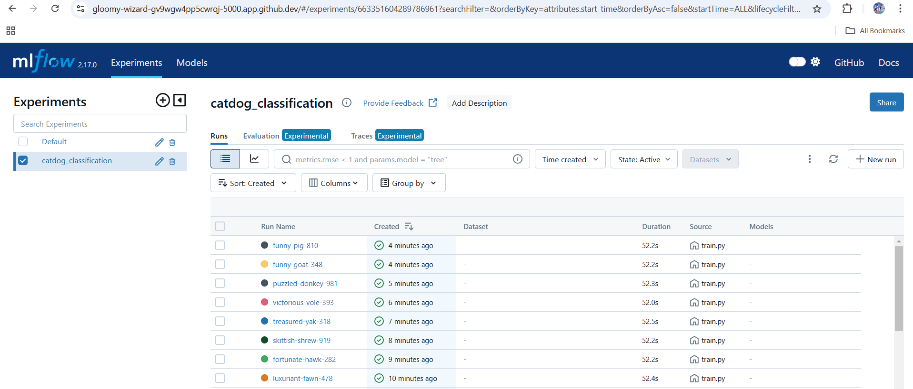
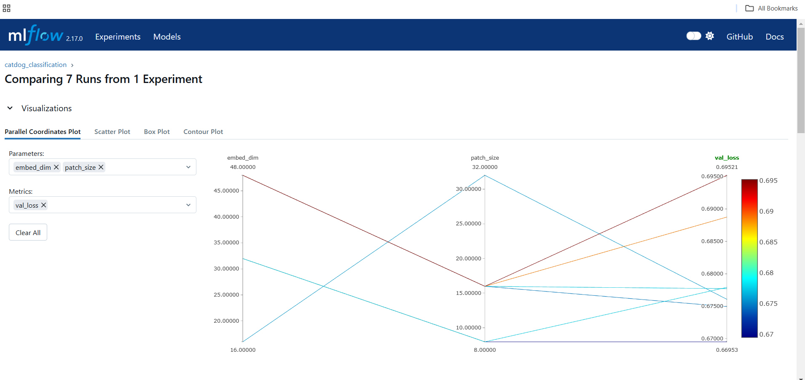
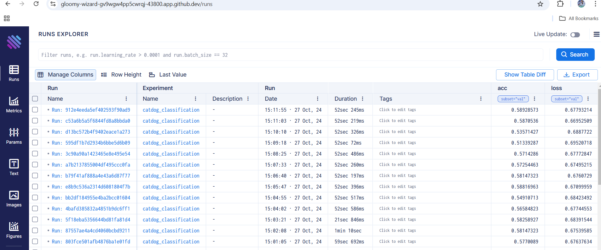
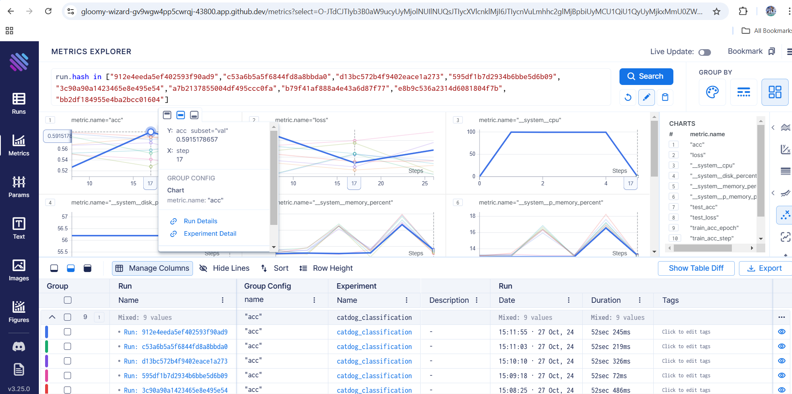
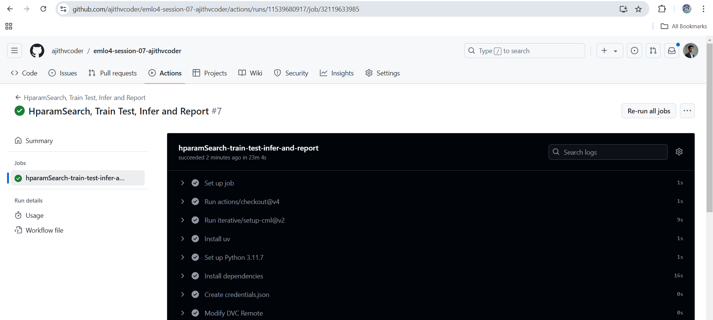
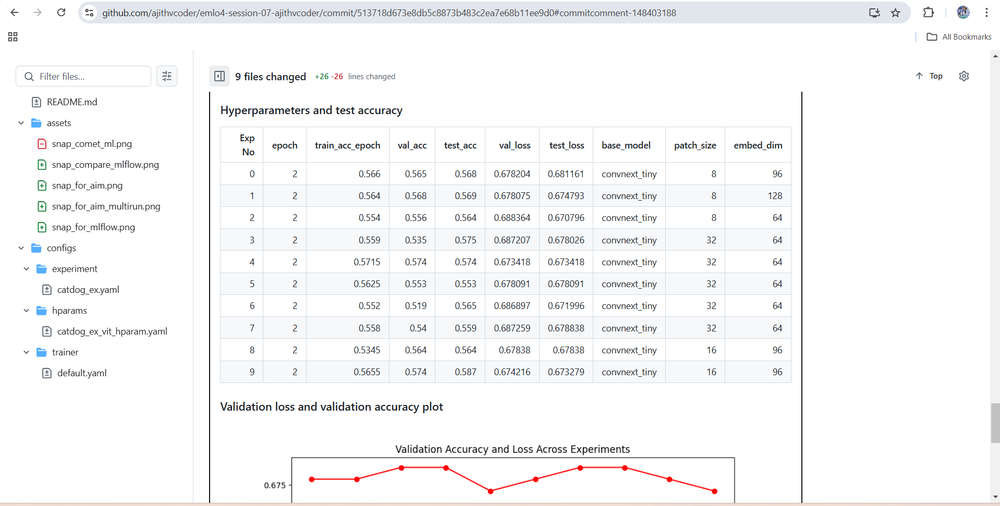

# s07-emlov4-hyperparams - Multi-run & Hyperparameter Optimization

### Contents

**Note: In addition to the requirements I have also done eval and infer pipeline to fetch optimized model checkpoint automatically**

- [Requirements](#requirements)
- [Development Method](#development-method)
    - [DVC Integration with Google Drive Storage](#dvc-integration-with-google-drive-storage)
    - [Integrate aim mlflow](#integrate-aim-mlflow)
    - [Setting up hyperparam search config files](#setting-up-hyperparam-search-config-files)
    - [Multirun personalization and report generation](#multirun-personalization-and-report-generation)
    - [Github Actions Pipeline](#github-actions-pipeline)
    - [Train-Test-Infer-Comment-CML](#train-test-infer-comment-cml)
- [Learnings](#learnings)
- [Results Screenshots](#results-screenshots)

### Requirements

- Your assignment is to Run Hyper Param Optimization with Github Actions
- Your CI/CD Action will add a comment at the end with a list of all hparams, and it's test accuracy in a table format
- Plot combined metrics for all runs (val/loss & val/acc)
- Optimize Params for any of these models:
    - https://github.com/huggingface/pytorch-image-models/blob/main/timm/models/mambaout.py
    - https://github.com/huggingface/pytorch-image-models/blob/main/timm/models/convnext.py
    - https://github.com/huggingface/pytorch-image-models/blob/main/timm/models/volo.py
- Dataset
    - Any! Just don't choose a really large dataset
    - You can use DVC, like the last assignment
- Perform at least 10 experiments, choose a smaller model so it doesn't take time.
- Each experiment should run for at least 2 epochs
- Before running the experiments, see if your model works with your hyper parameters options
- Use Cursor for suggesting the hyper parms and creating the hparams.yaml file


### Development Method

#### Build Command

**Debug Commands for development**

- Adjust below params in trainer/default.yaml for reduced dataset training. You can even train with 10% of dataset but if step numbers 
are low you may face problems in mlflow, aim loggings as it depends on step number for logging.

    ```
    limit_train_batches: 0.6
    limit_val_batches: 0.9
    limit_test_batches: 0.9
    ```

- Adjust below params in experiment/catdog_ex.yaml. Original model 27 million params and for reduced model it takes only 7.3k params

    ```
    depths: (1, 1, 2, 1)
    dims: (4, 8, 8, 16)
    ```


- I didnt figure out a way for replacing absolute path. For faster development i have used absolute paths for github actions kindly change it using vscode search and proceed with
`/workspaces/s07-emlov4-hyperparams/`

    ```
    /home/runner/work/s07-emlov4-hyperparams/s07-emlov4-hyperparams/ 
    ```

- Developed with `uv package` in local


**Hparam Search Train Test Infer Commands**

**Install**

```export UV_EXTRA_INDEX_URL: https://download.pytorch.org/whl/cpu```

OR 

```uv sync --extra-index-url https://download.pytorch.org/whl/cpu ```

if you are going by `--extra-index-url` method you might need to give it every time when u use `uv` command


**Pull data from cloud**

```dvc pull -r myremote```

**Trigger workflow**

```dvc repro```

Comment in PR or commit on which github actions is running
```cml comment create report.md```

### DVC Integration with Google Drive Storage
- Download gdrive file manually -> `use "uc?id=<drive-id>"` -> `gdown https://drive.google.com/uc?id=1V4awkaDGr8s1aI3VGoQUs1Ao6aF8_Os3`

- [Github Blog](https://github.com/ajithvcoder/dvc-gdrive-workflow-setup)
- [Medium blog](https://medium.com/@ajithkumarv/setting-up-a-workflow-with-dvc-google-drive-and-github-actions-f3775de4bf63)

**Add Train(Hparam search), test, infer, report_generation stages**

- `uv run dvc stage add -f -n train -d configs/experiment/catdog_ex.yaml -d src/train.py -d data/cats_and_dogs_filtered python src/train.py --multirun --config-name=train experiment=catdog_ex trainer.max_epochs=3`

- `uv run dvc stage add -n report_genration python scripts/multirun_metrics_fetch.py`

- `uv run dvc stage add -f -n test -d configs/experiment/catdog_ex.yaml -d src/eval.py  python src/eval.py --config-name=eval experiment=catdog_ex`

- `uv run dvc stage add -f -n infer -d configs/experiment/catdog_ex.yaml -d src/infer.py python src/infer.py --config-name=infer experiment=catdog_ex` 


- You would have generated a `dvc.yaml` file, `data.dvc` file and `dvc.lock` file push all these to github

- Note: You can still add more dependecies and output in dvc.yaml file to improve the quality and relaiablity

### Integrate AIM MLflow

- `AIM package` has a pytorch lighting integration so we can use that class in `__target__` of loggger.
 is already inegrated with pytorch lighting so we just need to add config files in "logger" folder and use proper api key for it.
    - Use `uv run aim init` then `uv run aim up` before staring training and then run the training commands.

- MLFlow is already inegrated with pytorch lighting so we just need to add config files in "logger" folder and use proper api key for it. After training has ran go into `logs/` folder which has `mlruns` and then run ```uv run mlflow ui```

- Comet-ML is already inegrated with pytorch lighting so we just need to add config files in "logger" folder and use proper api key for it.


### Github Actions Pipeline

- setup cml, uv packages using github actions and install `python=3.11.7`
- Copy the contents of credentials.json and store in github reprository secrets with name `GDRIVE_CREDENTIALS_DATA`

### Setting up hyperparam search config files

- `configs/hparams/` is used to store necesary parmaeters for hyper parameter searcg.

- For multi run in parallel below config can be used but the processor should be good to handle it else it will hang the system.

    ```uv run python src/train.py --multirun hydra/launcher=joblib hydra.launcher.n_jobs=4 experiment=catdog_ex model.embed_dim=16,32,64```

### Multirun personalization and report generation

**In multirun scenario we can't give a generic checkpoint name for eval.py and infer.py**

- In the `train.py` there is a class `CustomModelCheckpiont` which is used in `config/callbacks/model_checkpoint.yaml` is used to save the checkpoint file name with hparam config. example in this repo i have used `patch_size` and `embed_dim` for hyper param search so every checkpoint is stored with these contents as a filename. it could also be made more generic by using a for loop to fetch hyperparams and form a checkpoint file or giving a `uuid` for each runs final checkpoint.

- After `train.py` is completed `scripts/multirun_metrics_fetch.py` is ran and it collects hyper params and its corresponding val_acc, val_loss, test_acc, test_loss and forms table and plots. At last it takes `optimization_results.yaml` and fetches the best hyperparameters and saves the checkpoint file name to `best_model_checkpoint.txt`

- This `best_model_checkpoint.txt` is already stored in configs of eval and infer and its parsed and used when those configs are triggered

**Model Classifier**

- You can use `**kwargs` and import necessary configs related to `convnext` . Also you can feed the model necessary configs to it.

### Train-Test-Infer-Comment-CML

**Debugging and development**

Use a subset of train and test set for faster debugging and development. Also u can reduce the configs of model to generate a `custom 7.5k param convnext model`. I have reduced from 27 million params to 7.3k params by using the config. 

**Overall Run**
- `dvc repro`

**Train**
- `dvc repro train`

**Report**
- `dvc repro report_generation`

**Test**
- `dvc repro test`

**Infer**
- `dvc repro infer`

**Create CML report**

- Install cml pacakge
- `python scripts/multirun_metrics_fetch.py` will fetch the necessary files needed for report and log table and plots to report.md. Moreover it also creates a file `best_model_checkpoint.txt` which holds the **optimized configs checkpoint model**
- cml tool is used to comment in github and it internally uses github token to authorize


### CI Pipeline Development

- Using GitHub Actions and the `dvc-pipeline.yml`, we are running all above actions and it could be triggered both manually and on pull request given to main branch


### Learnings

- Learnt about AIM, MLFlow tool usage and multirun configurations and training.

### Results Screenshots

**MLFlow Dashboard**





**AIM Dashboard**






**Work flow success on main branch**

Run details - [here](https://github.com/mHemaAP/s07-emlov4-hyperparams/actions/runs/11642509543)



**Comments from cml with hyperparam search table and plots**

Details - [here](https://github.com/mHemaAP/s07-emlov4-hyperparams/commit/84bc29d1a414753f2084dde92c5fb0497ef1ccef#commitcomment-148655441)



Note: The objective is to complete the requirements of assignment with minimal resource so I have reduced dataset and model size and this makes training faster and in turn it made the accuracy to decrease.

