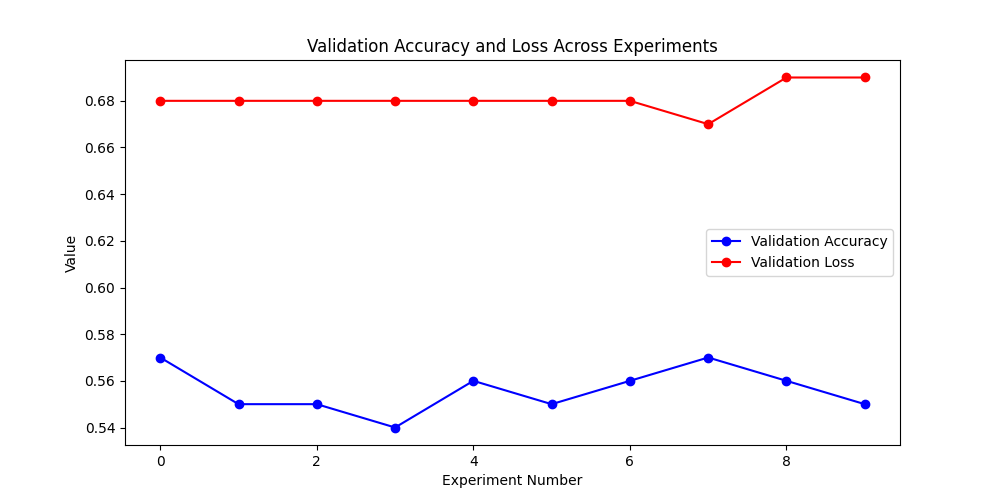

### Hyperparameters and test accuracy

|   Exp No |   epoch |   train_acc_epoch |   val_acc |   test_acc |   val_loss |   test_loss | base_model    |   patch_size |   embed_dim |
|---------:|--------:|------------------:|----------:|-----------:|-----------:|------------:|:--------------|-------------:|------------:|
|        0 |       4 |            0.555  |     0.571 |      0.571 |   0.676431 |    0.676431 | convnext_tiny |            8 |          96 |
|        1 |       4 |            0.561  |     0.548 |      0.57  |   0.682773 |    0.672774 | convnext_tiny |            8 |         128 |
|        2 |       4 |            0.5665 |     0.553 |      0.553 |   0.67908  |    0.67908  | convnext_tiny |            8 |          64 |
|        3 |       4 |            0.573  |     0.542 |      0.566 |   0.681956 |    0.675577 | convnext_tiny |           32 |          64 |
|        4 |       4 |            0.556  |     0.556 |      0.562 |   0.680866 |    0.674603 | convnext_tiny |           16 |          96 |
|        5 |       4 |            0.549  |     0.548 |      0.566 |   0.676319 |    0.678809 | convnext_tiny |           16 |          96 |
|        6 |       4 |            0.5495 |     0.562 |      0.562 |   0.677363 |    0.677363 | convnext_tiny |           16 |          96 |
|        7 |       4 |            0.5665 |     0.574 |      0.574 |   0.674099 |    0.674099 | convnext_tiny |           16 |          96 |
|        8 |       4 |            0.5605 |     0.555 |      0.575 |   0.685382 |    0.676185 | convnext_tiny |           32 |         128 |
|        9 |       4 |            0.562  |     0.554 |      0.566 |   0.690539 |    0.672306 | convnext_tiny |           32 |         128 |

### Validation loss and validation accuracy plot

### Optuna Hyperparameter Optimization 
#### Experiment Name:  **catdog_classification** 
#### Best Parameters: 
- **model.patch_size**: 32
- **model.embed_dim**: 128

## Best Value (Metric):
**0.575**
